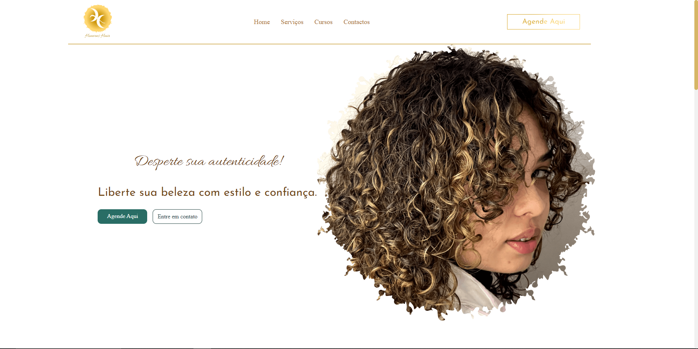
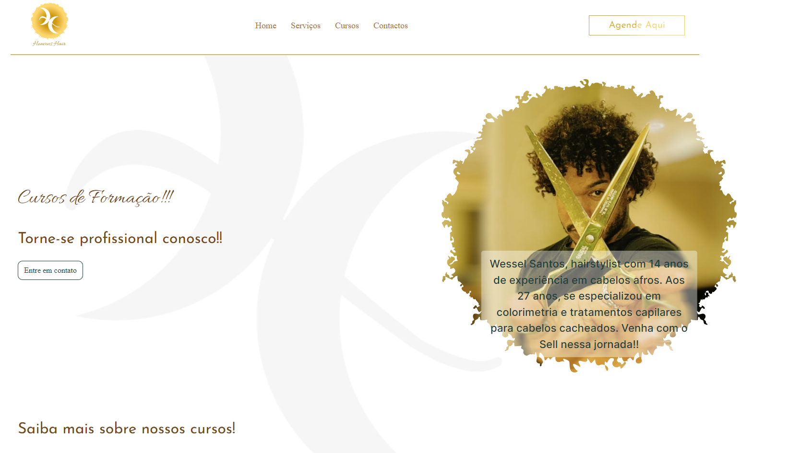

<div align="center">

# ✨ Heavens Hair ✨

### 💇🏾‍♀️ Desperte sua Autenticidade

<br/>


<br/>

> 🌿 Site institucional do salão **Heavens Hair**, especializado em cabelos afro, cacheados e ondulados em **Lisboa, Portugal**.
> Liderado pelo hairstylist **Wessel Santos**, com mais de **14 anos de experiência**.

<br/>

</div>

---

## 📸 Screenshots

<div align="center">

| 🏠 Página Inicial | 📚 Página de Cursos |
|:--:|:--:|
|  |  |

</div>

---

## 🚀 Funcionalidades

- ✅ **Página Inicial** — Hero animado, serviços, galeria de trabalhos e contato
- ✅ **Serviços** — Grid de cards com preços, duração e ícones dinâmicos
- ✅ **Galeria** — Portfólio de trabalhos com efeitos hover e overlay
- ✅ **Agendamento** — Sistema em 3 etapas com integração ao **Google Calendar**
- ✅ **Cursos** — Formação profissional em colorimetria e técnicas capilares
- ✅ **Contato** — Links diretos para WhatsApp, Instagram, Facebook e Email
- ✅ **Menu Responsivo** — Navegação adaptativa com popup mobile
- ✅ **Animações por Scroll** — Hook customizado com IntersectionObserver
- ✅ **Design System** — Tokens CSS, paleta de cores e tipografia consistente
- ✅ **SEO** — Metatags otimizadas por página
- ✅ **Página 404** — Página personalizada para rotas inexistentes
- ✅ **Termos de Responsabilidade** — Página completa com termos legais

---

## 🛠️ Tecnologias

<div align="center">

| Tecnologia | Descrição |
|:--:|:--|
|  **Next.js 14** | Framework React com App Router e SSR |
|  **React 18** | Componentes funcionais e Hooks |
|  **CSS3** | Custom Properties, animações e design tokens |
|  **JavaScript** | ES6+ com JSX |
| 🔤 **Google Fonts** | Allura, Inter, Josefin Sans, Playfair Display |
| 📅 **Google Calendar** | Integração de agendamento via URL |
| 🎠 **Swiper** | Carrosséis e sliders interativos |
| 🔍 **ESLint** | Linting e qualidade de código |

</div>

---

## 📁 Estrutura do Projeto

```
src/
├── app/                          # 🗺️ Rotas (App Router)
│   ├── layout.js                 # Layout global
│   ├── page.jsx                  # Página inicial
│   ├── not-found.jsx             # Página 404
│   ├── agendar/page.jsx          # Agendamento
│   ├── cursos/page.jsx           # Cursos
│   └── terms-of-responsibility/  # Termos
│
├── components/                   # 🧩 Componentes React
│   ├── agendamento/              # Sistema de agendamento (3 etapas)
│   ├── contatoForm/              # Seção de contato
│   ├── cursos/                   # Cards de cursos
│   ├── footer/                   # Rodapé
│   ├── gallery/                  # Galeria de trabalhos
│   ├── header/                   # Hero + Navegação
│   ├── servicos/                 # Cards de serviços
│   └── ...                       # Outros componentes
│
├── constants/gallery.js          # 📊 Dados da galeria
├── data/servicos.js              # 📊 Dados dos serviços
├── hooks/useScrollAnimation.js   # 🪝 Hook de animação por scroll
└── styles/                       # 🎨 Estilos globais e design tokens
```

---

## 💈 Serviços Disponíveis

| Serviço | 💰 Preço | ⏱️ Duração |
|---------|:--------:|:----------:|
| Corte Afro Feminino | 40€ | 60 min |
| Corte Afro Masculino | 40€ | 45 min |
| Coloração Completa | 40€ | 90 min |
| Madeixas & Luzes | 40€ | 120 min |
| Hidratação Profunda | 40€ | 60 min |
| Tratamento Capilar | 40€ | 75 min |
| Reconstrução Capilar | 40€ | 90 min |
| Botox Capilar | 40€ | 60 min |

---

## 📋 Como Usar

### Pré-requisitos

- **Node.js** 18+
- **npm** ou **yarn**

### 🔽 Clonar e Rodar

```bash
# 1. Clone o repositório
git clone https://github.com/dev-erickydias/heavens.git

# 2. Acesse a pasta do projeto
cd heavens

# 3. Instale as dependências
npm install

# 4. Inicie o servidor de desenvolvimento
npm run dev
```

🌐 Acesse: **http://localhost:3000**

### 📜 Scripts Disponíveis

| Comando | Descrição |
|---------|-----------|
| `npm run dev` | 🔧 Servidor de desenvolvimento com hot reload |
| `npm run build` | 📦 Build otimizado para produção |
| `npm start` | 🚀 Servidor de produção |
| `npm run lint` | 🔍 Verificação de código com ESLint |

---

## 🎨 Paleta de Cores

| Cor | Hex | Amostra |
|-----|-----|:-------:|
| Brown | `#734814` | 🟤 |
| Green | `#296d65` | 🟢 |
| Green Dark | `#1e403c` | 🌲 |
| Gold | `#d6b666` | 🟡 |
| Cream | `#fffcf5` | ⬜ |

---

## 📅 Sistema de Agendamento

O agendamento funciona em **3 etapas simples**:

1. 💇 **Escolha o serviço** — selecione entre os serviços disponíveis
2. 📅 **Data e horário** — escolha a data e horário desejado (09h–19h)
3. 📝 **Seus dados** — preencha nome, telefone e email

Após confirmar, um link para o **Google Calendar** é gerado automaticamente com todos os detalhes! 🎉

---

## 👨‍💻 Autor

<div align="center">

**Ericky Dias**

[](https://github.com/dev-erickydias)

</div>

---

<div align="center">

Feito com 💚 por **Ericky Dias**

⭐ Se gostou do projeto, deixe uma estrela!

</div>
